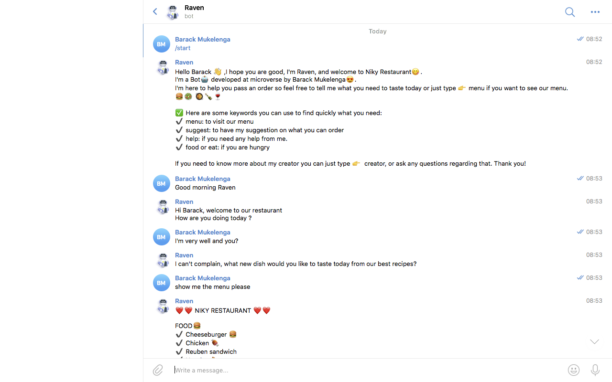

# Niky Restaurent Bot Raven

> Raven Bot is a Ruby-based Bot used in restaurants, helping clients to place an order inside restaurants easily with some fun using their phones. Raven can answer basic questions about greetings, compliments, and questions regarding placing an order in Restaurants. Raven is available on Telegram as @Niky_Raven_bot.

To have this project up and running I used the following technologies.

## Built With

- Ruby
- Telegram bot API

## Getting Started

**To have a local copy of the project you need to clone the repository by running the following command `git clone https://github.com/barackm/Niky-Restaurent-Bot.git`. However, this is not enough.**

To have the project up and running from you local copy you need to follow these steps:

### Prerequisites

You need to create a Telegram account.

### Setup

After you have created a Telegram account you will need to create a bot by searching for `botfather` in Telegram and click on the first result.
After that, you will need to send the following messages to the `botfather`.

- `/start` to see the menu
- `/newbot` to create a bot
- Then type the name of your Bot for exmple: `Ant Bot`
- Then choose a username for you Bot that must end in `bot` for exemple `my_ant_bot` and it has to be unique.

After you have entered these informations you will receive a message from botfather showing you all the necessary info you need to work with in development, the info include:

- API access token: a long string like `1749.....:AAHiDAp_830.........`
- A Telegram link to the bot channel, it will look like `t.me/my_ant_bot` if you named your bot `my_ant_bot` as username.

### Install

After you have got your API access token you will need to tell the program about that token so you can get access to the Bot. To do so you will need to open `bin/main.rb` file,
and replace the following line `token = ENV['BOT_NIKY_TELEGRAM_API_KEY']` to `token = (your new access token)`.
⚠️ The token needs to be in quotes (`' '`) like `token = '1749.....:AAHiDAp_830.........'`.

⚠️ If you need to push the project to `GitHub` you will need to hide your token key by doing the following:

- From the root of the project create a file named `.env` and add the line `BOT_NIKY_TELEGRAM_API_KEY = (your access token)` without quotes.
- Open again the file `bin/main.rb` and change the value of the `token` variable to be `ENV['BOT_NIKY_TELEGRAM_API_KEY']` to load the token from the `.env` file.

Now you can push your project to `GitHub` without any problem.

### Usage

To be able to interact with your bot now, you will need to run the following command from the root of the project in your terminal `bin/main.rb`.
Now you can open your telegram app and in the search bar type `@my_ant_bot` ⚠️ (replace this with your bot username). And that's all, now you can have fun with your bot 🤖.

### Run tests

To run the tests you will just need to run the command `rspec` in your terminal.

## Author

👤 **Baraka Mukelenga**

- GitHub: [@barackm](https://github.com/barackm)
- Twitter: [@BarackMukelenga](https://twitter.com/BarackMukelenga)
- LinkedIn: [Baraka Mukelenga](https://www.linkedin.com/in/baraka-mukelenga/)

## 🤝 Contributing

Contributions, issues, and feature requests are welcome!

Feel free to check the [issues page](https://github.com/barackm/Niky-Restaurent-Bot/issues).

## Show your support

Give a ⭐️ if you like this project!
